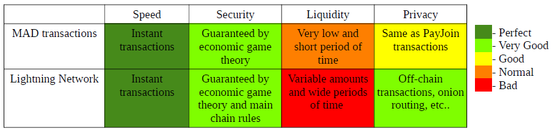

# MAD Transactions: Mutual Assured Destruction Transactions
**An attempt at better zero confirmation transactions in a full-RBF world.**
## Introduction

Zero confirmation transactions have been a controversial subject in bitcoin since its beginings and it has come back to this status recently with the last Bitcoin Core client release. The Bitcoin Core latest version, [24.0.1](https://bitcoincore.org/en/releases/24.0.1/), has a new configuration, **mempoolfullrbf**, wich allows the node to relay double spend transactions for any transaction present in the mempool, even non-signaling replace-by-fee (RBF) transactions. This policy is known as full-RBF and the default option is still set as non-activated. It is almost consensus that, because in the future miners’ revenue will only rely on fees, the natural mempool policy will be full-RBF. But the specific time when this change should occur is still a matter of debate. Many businesses in bitcoin, to this day, still use zero confirmation transactions, so this change could have a big impact for bitcoin users.

## Proposal
If there is consensus that full-RBF policy is inevitable why not use it to improve zero confirmation transactions?

How to do it?

Since in full-RBF any double spend will be “allowed” in the mempool, let’s make double spends even easier and build transactions that can be double spend by the two parties. We can achieve this using a modified version of a [PayJoin](https://en.bitcoin.it/wiki/PayJoin) transaction (aka [P2EP](https://blog.blockstream.com/en-improving-privacy-using-pay-to-endpoint/) transaction). PayJoin transactions aggregate UTXOs from merchant and customer with the goal of breaking [common-input-ownership](https://en.bitcoin.it/wiki/Common-input-ownership_heuristic) heuristic. These are the steps to build a MAD transaction:

- Merchant sends an UTXO that he controls to the customer together with his address.
- The customer creates a partially signed PayJoin transaction. Customer also creates another transaction using merchant’s input and his UTXOs that must have, in aggregate, at least **twice the value of the good being purchased**. If the number of UTXOs in the set is just one then the customer signs the input using SIGHASH_SINGLE flag together with the ouput to his change address receiving **all the value of his UTXO minus twice the value of the good**. If the number of UTXOs in the set is greater than one then a single input is signed with SIGHASH_SINGLE flag with the corresponding output and all the other inputs are signed using SIGHASH_NONE flag. At least one of the UTXOs must be present in both partially signed transactions. Customer then sends the two transactions back to merchant.
- Merchant signs the PayJoin transaction and broadcasts it and keeps the partial signed transaction to himself.

Now let’s see how this configuration can minimize trust in zero confirmation transactions. Because the customer has complete control over his UTXOs he can double spend them, but if he tries it as soon as the merchant sees a double spend of the PayJoin transaction in the mempool, the merchant can immediately broadcast the partial signed transaction with a slightly higher fee, which will be funded by the customer’s UTXO set.

When customer sees the merchant’s double spend he can try the same strategy increasing the fee so his new double spend transaction will be the one to be mined. It is easy to realize that this bid war will progress until the merchant has used the complete value of the customer’s UTXO for the fee and independently of who’s transaction has been mined we will reach the following scenario.

The merchant will be deprived of his product which values P bitcoins, and the customer will have the good but will lose at least twice the value in bitcoins, so he will end up losing P bitcoins in total. This scenario will happen regardless of who tries to cheat, if the merchant tries to charge more than what was agreed upon, the customer can start the process and the final state will be the same. Because we made possible for the two parties to double spend the PayJoin transaction using double the value of the good, we have created a mutual assured destruction ([MAD](https://en.wikipedia.org/wiki/Mutual_assured_destruction)) situation that prevents any party from deviating from equilibrium which is: do not double spend! Doing so can only lead to losses, for both sides.

The MAD situation is inescapable if someone deviates from agreement, so from the implementation point of view one single double spend transaction can be produce to save time and to deterrent the double spend, that transaction will consume twice the value of the good as fee using the partial signed transaction. This transaction is called: **nuclear transaction**.

## Security
#### Colussion with Miners
In which ways can this design go wrong? The critical part is the possibility of response from any side that faces a double spend and this possibility can be nullified if the attacker can hide his double spend transaction from the victim. The only way to do this is sending his transaction directly to a mining pool that must keep it private. Is there any incentive for the mining pool to keep the transaction private? No. Actually, if the mining pool has **λ** percentage of the hashrate, on average, the expected return that the mining pool will get exposing the double spend and then triggering the nuclear transaction is twice the price of the good times **λ**.

So, if the customer wants to execute a double spend, he has to share the profit with the mining pool, where the value has to be at least what the mining pool would get exposing the double spend. Let’s try to analize it:

- **X** = Good’s price in bitcoins.
- **p** = Percentage of the nuclear fee transaction the customer will share with the mining pool.
- **λ** = Mining pool percentage share of the network hashrate.

The expected value the mining pool gets exposing the double spend is **2Xλ**, and the value the mining pool gets in collusion with the customer is **2Xλp**. In the equilibrium **2Xλp=2Xλ** we see that is always more beneficial for the mining pool to stab the customer in the back triggering the nuclear transaction since they get higher expected profit from mining the nuclear transaction than collaborating with the customer. In the best case scenario the profit is the same as colluding when **p=1**, but in that situation the customer gets nothing out of the deal.

In a world where full-RBF is activated, zero confirmation transactions are very insecure and miners will be incentivized to mine double spends with higher fees, but in a world where full-RBF is activated and MAD transactions are implemented miners are incentivized to denounce double spends enforcing the security of zero confirmation transactions.

#### Fee Spikes

Since the nuclear transaction will be deployed whenever the PayJoin transaction is double spent this could be problematic in a fee spike situation where the transaction get stuck in the mempool and any legitimate RBF attempt will be seen as double spend. To circumvent this problem the protocol could be enhanced where in the second step the customer could sign another PayJoin transaction using SIGHASH_SINGLE|ANYONECANPAY instead of SIGHASH_ALL.

That way the merchant can increase the fee, even including another UTXO if necessary. The bad side of that possibility is that if the need to be incresed the HASHFLAG reveals the UTXO’s ownership, wich negates the very reason for using the PayJoin protocol in the first place.

#### Child Attacks

One possible rule for the implementation is not accepting partial signed transactions where the UTXOs have not been confirmed, when their parent transactions still are in the mempool. Accepting partial signed transactions with unconfirmed UTXOs can open the possibility for “child attacks” where the customer could make many purchases where the outputs of an unconfirmed PayJoin transaction could be used as input for another PayJoin transaction and so on. The customer could execute a double spend against the first transaction, although the nuclear transaction will be triggered, if the total price of goods bought is higher than twice the price of the first good than the attack will be successful since the other merchants will be oblivious to the attack and unable to respond.

## Comparing to the Lightning Network
The lightning network is a Bitcoin’s second layer technology that aspires to scale the bitcoin network with instant off-chain transactions. How MAD transactions can compare to the lightning network regarding instant transactions?

##### Speed
Both methods are instantaneous although the settlement period is totally different. MAD transactions are settled exactly as regular transactions, on the other hand lightning transactions are “never” settled on the main chain, only the closing channel transaction is settled on the main chain. In this regard the concept of settlement for lightning transactions is more dubious.

Because the time of settlement for MAD transactions is the same as for regular transactions, the nuclear transaction that guarantees the zero confirmation enforcement need to be kept for the same time as a regular transaction is considered settled. In Bitcoin usually this time is 6 confirmations, but it could be lower depending on implementation since 6 blocks reorgs are incredibly rare. In the lightning network the settlement on the main chain only happens when the channel is closed, and there is no limit for that period. So the revocation keys that are used to apply the penalty transaction must be kept as long as the channel is active. This is seen as a mild inconvenience.

##### Security
Both methods use game theory to guarantee their functionality. MAD transactions achieve enforcement through a threat of mutual loss for both sides of the transaction. The lightning network achieves this through penalty transactions that clean the channels balance completely in favor of the victim of the attack, when the other party tries to broadcast older states. But because the “justice system” in lightning is not symmetrical, sometimes it can produce injustice. The penalty could be executed not only in response to an attack but actually due to mistakes as broadcasting old states recorded in back ups or other bugs in the lightning software. In MAD transactions there is no possibility such mistake could occur once only legitimate double spend attempts will trigger nuclear transactions. It is necessary conscious will to create the double spends. Once the transaction is confirmed, nuclear transactions become completely harmless.

##### Liquidity

Usually this is considered the Achilles’ heel of the lightning network. In order to participate in the lightning network is necessary to open channels to other peers and that process will freeze funds in this channel for the entirety of the channels duration which incurs in an opportunity cost for these funds. And that is only for establishing outbound liquidity required to send payments, but to get inbound liquidity many costly and cumbersome methods are necessary like [submarine swaps](https://www.bitcoinlightning.com/submarine-swaps-the-lightning-network-dives-deep/) or paying for inbound liquidity.

In MAD transactions the situation is much simpler, the amount of funds that get locked in nuclear transactions is equal to the price of the good being purchased and the period of time is until the transaction is settled, which can vary from one to usually six confirmations depending on implementation, but this time is necessary only if the customer is performing another zero confirmation transaction before the previous one being confirmed. Otherwise the funds in the PayJoin transaction are ready right away for use in regular transactions.

##### Privacy
Privacy in lightning network is clearly better if compared to regular transactions on the main chain. Just the fact that lightning transactions occur off-chain and they use onion routing is an improvement over the main chain privacy. The deployment of taproot will increase privacy for lightning once open and cooperative closing channels will be indistinguishable from any other taproot transaction.

MAD transactions also offer an improvement in privacy since they break the common-input-ownership heuristic and if used widely could improve privacy for the whole Bitcoin network. Is worth to note that trying to double spend MAD transactions will trigger the nuclear transaction that not only generates losses for both sides also reveals the ownership of the inputs due to the SIGHASH flags creating another incentive to not double spend.

## Conclusion
Will MAD transactions make zero confirmation transactions completely trustless? No. Zero confirmation transactions still are a [second class citizen](https://bitcointalk.org/index.php?topic=1306.msg14714#msg14714) and will probably never be as secure as confirmed transactions. But MAD transactions try to give some trustlessness to zero confirmation transactions using a bit of game theory.

So summarizing, MAD transactions (actually a protocol) are composed by two transactions, a regular PayJoin transaction and a called nuclear transaction that is supposed not to be used. The nuclear transaction provides the ability for the two parties in the exchange double spend the PayJoin transaction leading to a situation of mutual assured destruction (MAD) which prevents the double spend. The down side compared to regular transactions is the fact that the protocol is interactive, but is hard to think in scenarios where the two parties would not be online using a zero confirmation transaction. In this way MAD transactions attempt to improve privacy and trust in zero confirmation transactions with a Bitcoin protocol that embraces full-RBF.
